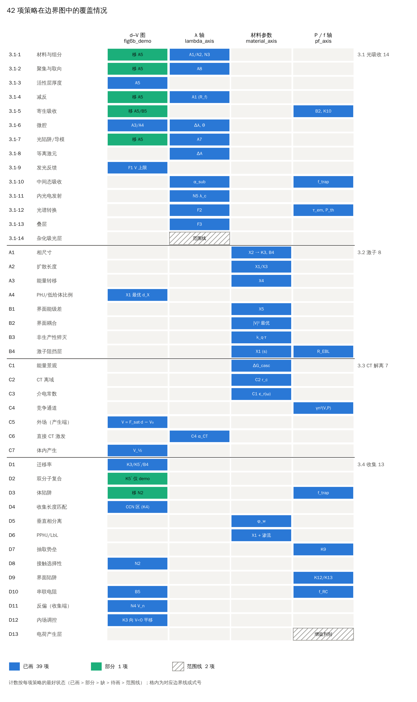

# 42 项策略的覆盖核对

> 核对每项策略落在哪张图、哪条边界线上，以及图里有没有画出来。
> 依据：《42种策略_通用边界模型.md》第 2 节“所在图轴”一列，以及绘图脚本实际画出的线：
> `demo_fig6b.py` → `fig6b_demo.png`（d–V），`axis_figures.py` → `lambda_axis.png`、`material_axis.png`、`pf_axis.png`。
> 图和表由同一份数据生成：`python3 coverage_42.py` → `coverage_42.png`，并打印下表。

## 结论

- 42 项策略**不对应 42 条 d–V 边界**。按“所在图轴”，直接落在 d–V 平面（d 轴或 V 轴）的约 14 项；其余在 λ 轴、材料参数（只移动 d–V 上已有的线）、P/f 轴，或只是范围线。另有 5 项光学策略（3.1-1、2、4、5、7）同时会移动吸收下限 A5。
- d–V 图上的多项共用一条线：D1/D2 共用 K3、K5′、B4；D3/D8 共用 N2；C5、C7、D12 与 D11 作用于同一个 V_eff。
- 当前状态（每项按最好状态计）：

| 状态 | 含义 | 项数 |
|---|---|---|
| 已画 | 该项的边界函数已在对应图中画出 | 39 |
| 部分 | 线已画，但只在示意图中有：D2 的 K5′ 需要光强，Luong 2024 没有给出，`luong2024_dV.png` 画不了 | 1 |
| 范围线 | 只判定是否超出本文范围（3.1-14 在 `lambda_axis.png` 画了范围线；D13 是增益判别式，没有曲线） | 2 |

### 本轮补上的内容（10-10）

- **d–V 图补 5 条线**（`opd_bounds.py` 新增 Eq.M1–M5，`fig6b_demo.png` 中为粗虚线）：
  - C5：产生端场饱和线 V = F_sat·d − V₀，F_sat 由 Onsager–Braun 弹性降到 ε_s 求出（Eq.M1）；
  - C7：单组分体内产生的半饱和线 V = F_½·d − V₀（Eq.M2）；
  - D12：内场调控后整条收集线向 V < 0 平移 ΔV_int，浅绿色为因此新增的可行区（Eq.M3）；
  - A4：PHJ 子层最优厚度 d_X* = argmax η_A·η_slab（Eq.M4）；
  - 3.1-9：发光反馈稳定性偏压上限 g(V) ≤ 1 − EQE₀（Eq.M5）。
- **RC 线 B5**：纵轴改为对数（10–2000 nm），约 20 nm 的 RC 下限现在可见。
- **三张新图**，每个小图对应一项策略：蓝线为收益函数，黑色点线为饱和边界，橙色阴影为失效区；补充式为 Eq.P1–P12。
  - `lambda_axis.png`：3.1-1、3.1-2、3.1-4、3.1-6、3.1-7、3.1-8、3.1-10、3.1-11、3.1-12、3.1-13、3.1-14、C6；
  - `material_axis.png`：A1、A2、A3、B1、B2、B3、B4、C1、C2、C3、D5、D6（含 A4 低给体）；
  - `pf_axis.png`：3.1-5、D3/3.1-10、3.1-12、B4、C4、D7、D9、D10。
- 所有参数都是示意值，只检查函数能否画成图；B2、D5 的收益函数是示意形式（文档第 2 节只给了定性关系），换体系时需要用实测关系替换。

## 逐项表

| 编号 | 策略 | d–V 图 (fig6b_demo) | λ 轴 (lambda_axis) | 材料参数 (material_axis) | P / f 轴 (pf_axis) |
|---|---|---|---|---|---|
| 3.1-1 | 材料与组分 | 部分：移 A5 | 已画：A1/A2, N3 |  |  |
| 3.1-2 | 聚集与取向 | 部分：移 A5 | 已画：A8 |  |  |
| 3.1-3 | 活性层厚度 | 已画：A5 |  |  |  |
| 3.1-4 | 减反 | 部分：移 A5 | 已画：A1 (R_f) |  |  |
| 3.1-5 | 寄生吸收 | 部分：移 A5/B5 |  |  | 已画：B2, K10 |
| 3.1-6 | 微腔 | 已画：A3/A4 | 已画：Δλ, θ |  |  |
| 3.1-7 | 光陷阱/导模 | 部分：移 A5 | 已画：A7 |  |  |
| 3.1-8 | 等离激元 |  | 已画：ΔA |  |  |
| 3.1-9 | 发光反馈 | 已画：F1 V 上限 |  |  |  |
| 3.1-10 | 中间态吸收 |  | 已画：α_sub |  | 已画：f_trap |
| 3.1-11 | 内光电发射 |  | 已画：N5 λ_c |  |  |
| 3.1-12 | 光谱转换 |  | 已画：F2 |  | 已画：τ_em, P_th |
| 3.1-13 | 叠层 |  | 已画：F3 |  |  |
| 3.1-14 | 杂化吸光层 |  | 范围线：范围线 |  |  |
| A1 | 相尺寸 |  |  | 已画：X2 → K3, B4 |  |
| A2 | 扩散长度 |  |  | 已画：X1/X3 |  |
| A3 | 能量转移 |  |  | 已画：X4 |  |
| A4 | PHJ/低给体比例 | 已画：X1 最优 d_X |  |  |  |
| B1 | 界面能级差 |  |  | 已画：X5 |  |
| B2 | 界面耦合 |  |  | 已画：|V|² 最优 |  |
| B3 | 非生产性猝灭 |  |  | 已画：k_q·τ |  |
| B4 | 激子阻挡层 |  |  | 已画：X1 (s) | 已画：R_EBL |
| C1 | 能量景观 |  |  | 已画：ΔG_casc |  |
| C2 | CT 离域 |  |  | 已画：C2 r_c |  |
| C3 | 介电常数 |  |  | 已画：C1 ε_r(ω) |  |
| C4 | 竞争通道 |  |  |  | 已画：γn²(V,P) |
| C5 | 外场（产生端） | 已画：V = F_sat·d − V₀ |  |  |  |
| C6 | 直接 CT 激发 |  | 已画：C4 α_CT |  |  |
| C7 | 体内产生 | 已画：V_½ |  |  |  |
| D1 | 迁移率 | 已画：K3/K5′/B4 |  |  |  |
| D2 | 双分子复合 | 部分：K5′ 仅 demo |  |  |  |
| D3 | 体陷阱 | 部分：移 N2 |  |  | 已画：f_trap |
| D4 | 收集长度匹配 | 已画：CCN 区 (K4) |  |  |  |
| D5 | 垂直相分离 |  |  | 已画：φ_w |  |
| D6 | PPHJ/LbL |  |  | 已画：X1 + 渗流 |  |
| D7 | 抽取势垒 |  |  |  | 已画：K9 |
| D8 | 接触选择性 | 已画：N2 |  |  |  |
| D9 | 界面陷阱 |  |  |  | 已画：K12/K13 |
| D10 | 串联电阻 | 已画：B5 |  |  | 已画：f_RC |
| D11 | 反偏（收集端） | 已画：N4 V_n |  |  |  |
| D12 | 内场调控 | 已画：K3 向 V<0 平移 |  |  |  |
| D13 | 电荷产生层 |  |  |  | 范围线：增益判别 |

